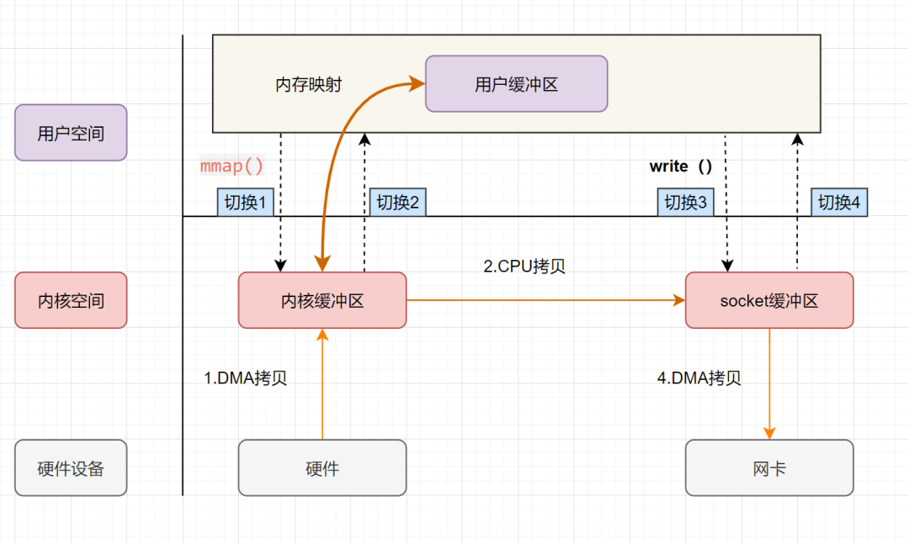
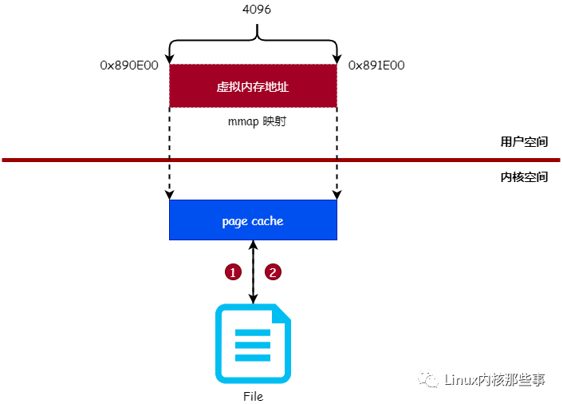

## mmipc
使用mmap实现的跨进程通信组件，也可用于写入数据较多的场景。

## 背景
说到跨进程通信，你可能对Binder有着莫名的崇拜之情，因为它几乎贯穿了整个Android系统的跨进程通信任务，如果你探究到Binder是通过mmap实现的时候，你是否跟我一样，想用mmap实现一个跨进程组件，这就是
我创建该项目的目的，对于你来说，这是一个不错的学习mmap的开源项目。

## 对比Binder

优势：
- 通信数据大小突破binder限制
- 轻量级，易用

缺点：
- 安全，目前未考虑安全性，后续可以加进来，比如对数据加密，对外部进程访问加入验证规则

## mmap原理

mmap 的函数
```c
void *mmap(void *addr, size_t length, int prot, int flags, int fd, off_t offset);
```
- addr：指定映射的虚拟内存地址
- length：映射的长度
- prot：映射内存的保护模式
- flags：指定映射的类型
- fd:进行映射的文件句柄
- offset:文件偏移量

mmap使用了虚拟内存，可以把内核空间和用户空间的虚拟地址映射到同一个物理地址



图中展示的是mmap将读缓冲区的地址和用户缓冲区的地址进行映射，内核缓冲区和应用缓冲区共享，并且用户进程内存是虚拟的，只是映射到内核的读缓冲区，节省一半的内存空间

再来看一张图



读写文件都需要经过页缓存，所以 mmap 映射的正是文件的 页缓存，而非磁盘中的文件本身。由于 mmap 映射的是文件的 页缓存，所以就涉及到同步的问题，即 页缓存 会在什么时候把数据同步到磁盘

Linux 内核并不会主动把 mmap 映射的 页缓存 同步到磁盘，而是需要用户主动触发。同步 mmap 映射的内存到磁盘有 4 个时机：

- 调用 msync 函数主动进行数据同步（主动）

- 调用 munmap 函数对文件进行解除映射关系时（主动）

- 进程退出时（被动）

- 系统关机时（被动）


## 实现Android跨进程通信

### 用例

初始化
```kotlin

class App : Application() {

    companion object {
        var mmipc: MMIPC = MMIPC()
    }

    override fun onCreate() {
        super.onCreate()
        val path: String = this.externalCacheDir!!.absolutePath + File.separator + "mmipc.arsc"
        "init".print(getProcessName())
        mmipc.initMMAP(path)
    }
}
```
保存数据
```kotlin
   App.mmipc.setData("1", "2")
   App.mmipc.setData("3", "4")
```
获取数据，不分进程
```kotlin
    App.mmipc.getData()
    App.mmipc.getData("key")
    App.mmipc.getData("key","defaultValue")
```

### 部门源码分析
待补

## 参考
<https://github.com/Tencent/MMKV>
<https://mp.weixin.qq.com/s/YjwxeLCwvJxXn7HPOF4Ayw>
<https://mp.weixin.qq.com/s/xTKQjb45gzRIUjKzSBOKsg>